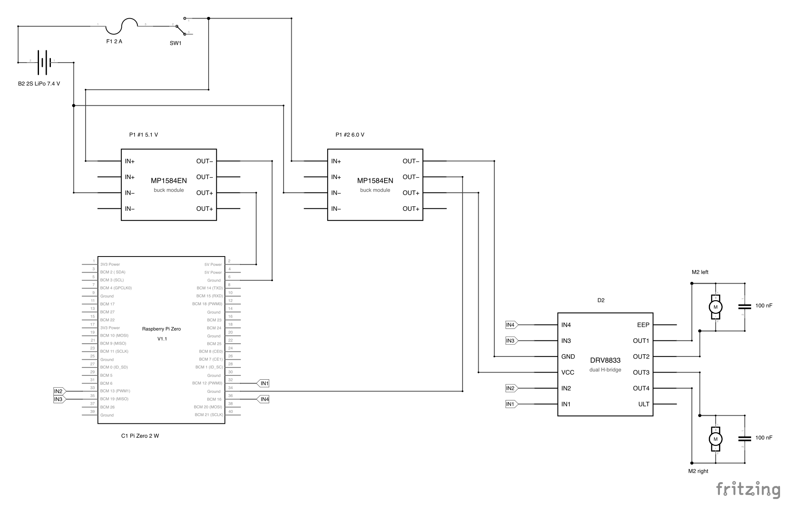

# robot_car — drivetrain wiring

How the prototype's electronics hang together: B2 LiPo → two P1 bucks → C1
(Pi Zero 2 W) for logic and D2 (DRV8833) for power, driving two M2 N20
gearmotors. Part IDs are the ones in [parts/index.html](../../parts/index.html).

Status (2026-09-26): one link of the chain has run. One B2 pack → a 10 A
fuse → one P1 buck at 6.0 V → bridge A of one D2 → one M2, with `IN1` pulled high
through 10 kΩ: the motor ran, and reversed with the resistor moved to `IN2`.
That is bring-up step 4 for bridge A, powered from the pack instead of a bench
supply, and it is why M2, D2, P1 and B2 read `ok` in the parts library. D2's
bridge B, the Pi (C1, still `verify`) and steps 5–7 are not done yet, so the
rest of this page is still the plan to bring up, in the order given under
[Bring-up](#bring-up), not a tested circuit.

The 10 A fuse was what was on the bench for that test. The car's harness
takes the **2 A** fuse specified under [Power](#power); don't copy the test
rating.

## What the D2 pins actually are

D2 is a DRV8833 breakout: 12 pins in two 6-pin rows, silkscreened on the face
*opposite* the chip. The board is a thin wrapper around the IC — every pin goes
more or less straight to a chip pin, so the datasheet (TI SLVSAR1E) is the real
reference.

| D2 pin | DRV8833 pin | What it is |
| --- | --- | --- |
| `VCC` | VM | Single supply: motor rail *and* chip supply. 2.7–10.8 V |
| `GND` | GND | Ground, shared with the Pi |
| `IN1` / `IN2` | AIN1 / AIN2 | Logic inputs for bridge A |
| `OUT1` / `OUT2` | AOUT1 / AOUT2 | Bridge A outputs → motor A |
| `IN3` / `IN4` | BIN1 / BIN2 | Logic inputs for bridge B |
| `OUT3` / `OUT4` | BOUT1 / BOUT2 | Bridge B outputs → motor B |
| `ULT` / `EEP` | nFAULT / nSLEEP — **or the other way round** | See below |

`ULT` and `EEP` read like silkscreen with the first letters clipped off:
(FA)`ULT` = nFAULT, (SL)`EEP` = nSLEEP. Two things support that reading: the
`en` / `sleep` solder jumpers sit right next to the `EEP` pin, which is where
you'd put a default-state selector for nSLEEP; and the front side carries a
`473` (47 kΩ) resistor, which is exactly the 20–75 kΩ nSLEEP pull-up TI asks
for in §7.3.4. The seller's listing says the opposite (`ULT` = sleep select,
`EEP` = "output protection"), so this is not settled — see
[Open questions](#open-questions) for the meter test that settles it.

It doesn't block the first build: the `en` jumper is bridged from the factory,
which is what leaves the chip awake, and neither pin needs a wire for basic
two-motor drive.

Board features worth knowing, from the back-side photo
([d2-drv8833-back.jpg](../../parts/photos/d2-drv8833-back.jpg)):

- `en` solder jumper: **bridged** (factory default). `sleep` jumper: open.
  `J1`, a 2-pad SMD footprint next to `EEP`, is unpopulated.
- The 12 header holes are bare — the two 6-pin strips still need soldering.
- No current-sense resistors on the board, so AISEN/BISEN are grounded and
  the chip's PWM current chopping is unused. The only current limit is
  overcurrent protection at 2–3.3 A, which the M2 motors (0.2 A stall) will
  never reach.

## Connections



The schematic's source is [robot_car.fzz](robot_car.fzz). Edit it in Fritzing
or with the fritzing-format skill, then re-render the PNG. The Pi symbol is
Fritzing's Pi Zero V1.1; the Zero 2 W has the same 40-pin header. The MP1584
and DRV8833 symbols are hand-made and bundled in the sketch. Each MP1584 net
has two header pins, and the part ties IN− and OUT− together, as the board
does. The DRV8833 symbol keeps the board's pin order (see
[parts/d2.html](../../parts/d2.html)). `GND` and `VCC` sit mid-row between the
inputs, so `IN1`–`IN4` are drawn as net labels rather than wires that would
cross the supply.

### Pi Zero 2 W → D2 (4 signals + ground)

| Pi header pin | BCM | D2 pin | Note |
| --- | --- | --- | --- |
| 32 | GPIO12 | `IN1` | left motor, forward |
| 33 | GPIO13 | `IN2` | left motor, reverse |
| 35 | GPIO19 | `IN3` | right motor, forward |
| 36 | GPIO16 | `IN4` | right motor, reverse |
| 34 | — | P1 #2 second `OUT−` pin | signal ground; **not optional** — see [Grounds](#grounds) |

Why these four GPIOs: they sit in one block at the far end of the header (one
short ribbon, no fan-out), none of them has a competing default function
(I²C on GPIO2/3 is left free for the S1 rangefinder later, UART on GPIO14/15
for the console, SPI on GPIO7–11), and — the reason that matters — every GPIO
from 9 up idles with an internal *pull-down* at boot. GPIO0–8 idle pulled
*high*, which against the DRV8833's 150 kΩ input pull-downs would put ~2.5 V
on an input: above the 2 V VIH, i.e. a motor twitching before Linux has
even booted. Don't move the inputs onto those.

The Pi's 3.3 V logic is enough on its own: VIH is 2 V on the IN pins (2.5 V on
nSLEEP), and the inputs are rated to 7 V absolute max, so no level shifting and
no series resistors are needed. Every unconnected input pulls itself low
(150 kΩ internal, 500 kΩ on nSLEEP), so anything you leave floating reads as
"off".

#### Finding those pins on the board

From the top-face photo ([c1-pi-zero-2w-top.jpg](../../parts/photos/c1-pi-zero-2w-top.jpg)): the 40-pin
header is **already populated with male pins** — ten 4-way plastic blocks in
one strip, 2 × 20 on 2.54 mm pitch — so unlike D2, the Pi end needs no
soldering. (Straight down, those pins read as recessed contacts in black
wells; edge-on they are plainly pins.)

D2 gets male pins too, so **the four signal wires are female–female jumper
leads** — a Dupont socket on each end, pushed onto a pin at each board. A
20 cm 40-way rainbow ribbon is the thing to buy: peel off a 4-wide strip for
pins 32, 33, 35 and 36 and it stays in order by itself, which is most of the
defence against miscounting. Nothing needs crimping or soldering for those
four.

The fifth lead, pin 34's ground, is different: it goes to buck #2's second
`OUT−` header pin, not to D2, and carries a share of the ground current (see
[Grounds](#grounds)). Make it from 22 AWG with a Dupont socket crimped on each
end, and run it alongside the signal strip.

Orientation, then, with the header along the far edge and the connector edge
(mini-HDMI, `USB`, `PWR IN`) toward you:

- Header **pin 1 is at the microSD end** — the left end in that view. Pins
  32–36 are at the other end, beside the CSI camera connector and roughly
  above the `PWR IN` jack.
- The 5 V and GND pins that feed the Pi (2, 4, 6) are at the *pin-1* end, i.e.
  the opposite end of the header from the driver ribbon. Buck feed in at one
  end, signals out at the other; plan the cable runs that way rather than
  bundling them.
- Confirm the numbering with a meter before the first wire, because which of
  the two rows carries the odd numbers is easy to get backwards. Continuity
  from a header pin to a micro-USB shell finds the grounds — pins 6, 9, 14,
  20, 25, 30, 34, 39. At the far end from the SD card, the last pair is 39
  (GND) and 40 (GPIO21): the one that beeps is 39, and that fixes both rows.
  Pin 34, the ground lead, is then three pairs back along the even
  row (40, 38, 36, 34) — and it should beep too.

### D2 → M2 motors (4 wires)

| D2 pin | Motor |
| --- | --- |
| `OUT1` | left motor tab (+) |
| `OUT2` | left motor tab (−) |
| `OUT3` | right motor tab (+) |
| `OUT4` | right motor tab (−) |

The (+)/(−) marks on the N20 can only fix which way "forward" comes out; they
carry no polarity requirement, so if a wheel turns the wrong way, swap the pair
in software rather than resoldering. `chassis.py` mirrors the motor cradle for
±Y, so the two motors point in opposite directions and one side's sense is
inverted by construction — handle that in the motor object, not at the
terminals.

Solder a 100 nF ceramic across each motor's two tabs, as close to the can as
you can get it, and twist each motor pair. Brushed motors are broadband noise
sources and the Pi's WiFi and microSD are both nearby.

### Power

| From | To | Value |
| --- | --- | --- |
| B2 XT60 (+) | fuse → switch → both P1 `IN+` | 7.4 V nominal, 8.4 V full |
| B2 XT60 (−) | both P1 `IN−` | star point for all grounds |
| P1 #1 `OUT+` | Pi header pin 2 (or 4) | set to 5.1 V |
| P1 #1 `OUT−` | Pi header pin 6 | |
| P1 #2 `OUT+` | D2 `VCC` | set to 6.0 V |
| P1 #2 `OUT−` (one pin) | D2 `GND` | motor current return |
| P1 #2 `OUT−` (other pin) | Pi header pin 34 | Pi–D2 ground reference |

Two bucks rather than one shared 5 V rail: a stalling motor drags its rail
down, and the thing on the other end of a shared rail would be the Pi's SD
card. We have five P1s; separating the rails is cheaper than a corrupted card.
(One buck plus a fat bulk cap does work — it's just the variant to fall back
to, not the one to start with.)

On the chassis the two bucks sit in trays either side of the battery: P1 #1
(5.1 V, Pi) on the right, P1 #2 (6.0 V, D2) on the left, the same side as
D2, so each rail's wiring stays on its own side of the car. Both ride
components down, and a board can't be mirrored, so they sit rotated 180°
to each other: P1 #2 has `IN` at the rear, next to the switch, and `OUT`
at the front; P1 #1 has `IN` at the front and `OUT` at the rear.

The switch (a KCD1-style mini rocker, [kcd1_rocker.py](../parts/kcd1_rocker.py)) snaps into
a well on the left, between the motor cradle and P1 #2, its bent terminals
pointing forward. Wires solder straight onto the middle and outer
(outboard) terminal tips; the inner one is unused.

#### Grounds

Everything shares one ground: the P1 has no isolation, so its `IN−` and `OUT−`
pads are the same copper, and both bucks' `IN−` meet at the pack minus.
Two ground wires meet at buck #2, because they do different jobs:

- **P1 #2 `OUT−` → D2 `GND`** is the motor current's direct return to the
  buck that sourced it.
- **Pi pin 34 → P1 #2's other `OUT−` pin** ties the Pi's 0 V to D2's at the
  buck, so D2 reads `IN1`–`IN4` against the ground the Pi drives them from.
  D2 has a single `GND` pin, but the buck's `OUT−` pad pair carries a 2-pin
  header, so the two leads meet there, one per pin, in one 2-pin housing. Run this lead alongside the four
  signal wires and split it off only near the buck: it is their return path,
  and a ground routed away from them opens a loop that picks up motor noise.
  Meter both `OUT−` pins to `IN−` before the first wire: all three should
  beep.

The pin-34 lead is not signal-only. Pins 6 and 34 share the Pi's ground
plane, so the Pi's two ground leads, both bucks and their pack-minus wires
form a loop, and every return current in it splits by resistance. The Pi's
return current comes in at its ground plane; the pack takes back the bucks'
*input* current at the pack minus, and buck #1 takes the difference. Solving
that network with the pin 6 lead at 15 cm and the pin 34 lead at 20 cm of
22 AWG, 10 cm of 20 AWG from each buck to the pack minus and a 7.4 V pack,
pin 34 carries ~0.4 A at the Pi's 1 A peak and ~0.15 A at a typical 0.4 A.
Running motors lower it slightly, because buck #2's input return flows the
other way through the loop. That is why the lead is 22 AWG, like the Pi's
power leads. The same solve puts the Pi–D2 ground offset under ~10 mV (≤5 mV
across the loop plus ~4 mV on D2's own ground lead at a double stall), with
motor switching spikes on top, far inside the 0.7 V / 2 V input
thresholds. The wire lengths are estimates, so treat the figures as a scale,
not a spec. Bring-up step 7 measures it rather
than trusting the estimate. Short, thick pack-minus wires keep the shares
small: they are the low-resistance side of the loop.

D2's only ground is its wire to the buck, so that connection has to be
dependable. If it comes loose while `VCC` is live, D2's ground floats up
and the chip finds a return through `IN1`–`IN4` into the Pi's GPIOs. At D2,
put `VCC` and `GND` (adjacent pins in the same row) into one 2-pin Dupont
housing; at the buck, its `GND` lead shares the `OUT−` housing with the
pin-34 lead. That makes an accidental separation less
likely, but a half-pulled housing or a backed-out contact can still leave
`VCC` on with `GND` open, so it is not a guarantee. Add strain relief: tie
the pair to the chassis a few cm from D2 so a tug lands on the tie, not the
contacts. Only plug or unplug D2 with the switch off. An ordinary jumper
lead carries the current easily (0.4 A over 20 cm of 26 AWG drops ~10 mV);
what it lacks is grip.

#### From the pack to the bucks

The pack ends in an XT60 and the P1s carry 2-pin male headers on their pad
pairs, so something has to bridge them. What goes between:

```
B2 pack ──XT60── pigtail ── 2 A fuse ── switch ──┬── P1 #1 (5.1 V) → Pi
                                                 └── P1 #2 (6.0 V) → D2
                         (both P1 `IN−` and every other ground: pack minus)
```

- **XT60 pigtail.** Gender goes by the metal, not the plastic shell — prongs
  are male, sockets female, and the housings look backwards from that, which
  is where the confusion comes from. The pack should carry sockets (the RC
  convention: a live pack shouldn't present bare prongs), so the harness end
  is normally the male. Buy a male + female pair with silicone tails already
  attached and there is nothing to solder on the connector itself, and a spare
  if the pack turns out to be the other way round.
- **A 2 A fuse** in the positive lead, as close to the pack as it will go.
  Worst-case draw is ~1.1 A (below); the pack is a 2200 mAh 2S that will feed
  a short with tens of amps, and its own leads are 12 AWG for a reason. The
  fuse is what keeps a slipped probe from becoming a fire.
- **A switch** rated 5 A or more, so the XT60 isn't the on/off control. They
  are stiff to mate and rated for a few hundred cycles.
- **The fan-out to two bucks** wants a junction, not two wires stuffed into
  one header pin: a lever connector (WAGO 221) or a screw terminal, then a
  22 AWG lead with a Dupont socket to each buck's `IN+` and `IN−` pins.
  The bucks need no soldering; the switch's terminals do (see above).

**The P1 has no reverse-polarity protection** ([parts/p1.html](../../parts/p1.html)), so a swapped
input kills the module and can pass 7.4 V downstream into the Pi. That is the
argument for keeping the XT60 as the pack interface everywhere: it is keyed
and cannot mate backwards. Red is +, black is −, and check with a meter at
the pigtail before the first connection.

Current, for sizing: the Pi at its 1 A worst case draws ~0.75 A from the pack
through the buck, and two motors at their 0.2 A stall another ~0.36 A —
so ~1.1 A worst case, and more like 0.4 A actually driving. That is a few
hours of bench time from a 2200 mAh pack.

#### Wire

Signal wires can be ordinary jumper leads; the battery side cannot. What sets
the gauge there is not the ~1 A running current but the fault current if
something shorts ahead of the fuse.

| Run | Wire |
| --- | --- |
| Pack → fuse → switch → junction | 20 AWG silicone, or the pigtail's own 14 AWG |
| Junction → buck `IN+`/`IN−` | 22 AWG with Dupont sockets (the largest a Dupont crimp takes); ~0.75 A worst case per buck |
| Buck → D2 `VCC`/`GND` | 22 AWG, Dupont sockets; a strain-relieved 2-pin housing at D2 (see [Grounds](#grounds)) |
| Buck → Pi header pins 2/6 | 22 AWG; a jumper lead works electrically (1 A over 15 cm of 24 AWG drops ~15 mV) but the crimp is what fails |
| D2 → motors | 22–24 AWG, twisted pair, 100 nF across the tabs |
| Pi → D2 `IN1`–`IN4` | ordinary jumper leads — microamps |
| Pi pin 34 → P1 #2 `OUT−` | 22 AWG, Dupont sockets, sharing a 2-pin housing with D2's `GND` lead at the buck; carries a share of the return current (see [Grounds](#grounds)) |

Silicone-insulated stranded, not PVC hookup wire: it stays flexible in a
chassis and doesn't shrink back from the soldering iron.

Why 6.0 V on the driver, and why not the raw pack:

- The M2 motors are the 6 V/1:100 variant, so a 6.0 V rail makes PWM duty map
  straight onto rated voltage — 100% duty is rated speed, nothing to
  remember. Raw 2S would be 8.4 V on a 6 V motor, correct only while you
  remember to cap duty at ~70%.
- 6.0 V also keeps every pin on the chip inside spec whatever the `en`
  jumper turns out to tie nSLEEP to. If it's a hard tie to VM (rather than
  through the 47 kΩ), nSLEEP sits at the rail: fine at 6.0 V (7 V absolute
  max, internal 6.5 V clamp), not fine at 8.4 V. Until the meter says
  otherwise, **keep `VCC` at or below 6.5 V**.
- Bridge drop is irrelevant at these currents: 360 mΩ HS+LS × 0.04 A running
  is 14 mV, and 72 mV at the 0.2 A stall. No need to over-volt to compensate.

Add a 100–220 µF electrolytic (≥16 V) across D2's `VCC`/`GND` if the wires
back to the buck are longer than a few centimetres — the board's own 10 µF
ceramic covers the chip, not the wiring inductance (§9.1).

Set both trimpots and measure the output with a meter **before** either board
is connected. The P1 ships at an arbitrary trimpot position, and the Pi's 5 V
header pins go straight to the SoC's regulators with no input protection.

`EEP` and `ULT` need no wires. Once you know which is nFAULT, a 10 kΩ pull-up
to the Pi's *3.3 V* (pin 1 or 17) plus a spare GPIO gets you fault reporting —
it's open-drain, low on overcurrent or thermal shutdown, and it retries by
itself every 1.35 ms while the fault lasts.

## Control logic

Per bridge, from the datasheet's Table 1 and Table 2:

| IN1 | IN2 | OUT1 | OUT2 | Result |
| --- | --- | --- | --- | --- |
| 0 | 0 | Z | Z | coast (free-wheel) |
| 1 | 0 | H | L | forward, full speed |
| 0 | 1 | L | H | reverse, full speed |
| 1 | 1 | L | L | brake (both outputs shorted low) |

For speed control you PWM one input and hold the other:

| IN1 | IN2 | Result |
| --- | --- | --- |
| PWM | 0 | forward, fast decay (coasts between pulses) |
| 1 | PWM | forward, slow decay (brakes between pulses) |
| 0 | PWM | reverse, fast decay |
| PWM | 1 | reverse, slow decay |

Fast decay is the simpler scheme and what `gpiozero`'s `Motor` does: PWM the
"forward" pin, hold "backward" low. Slow decay gives a more linear
duty→speed curve at low duty, at the cost of inverted logic (duty *D* forward
means driving the PWM pin at 1−*D*). Start with fast decay; only reach for
slow decay if the motors won't creep smoothly.

No maximum input PWM frequency is specified, but the input deglitch is 450 ns
and INx→OUTx propagation is 1.1 µs, so keep the period well clear of those:
2 kHz is a good starting point, and gives 100 duty steps under pigpio's
default 5 µs sampling.

Software PWM on the Pi is fine here — these are brushed gearmotors, not a
servo loop. `pigpio`'s DMA-timed PWM works on any pin:

```python
import pigpio

pi = pigpio.pi()
LEFT = (12, 13)   # (forward, reverse) → IN1, IN2
RIGHT = (19, 16)  # → IN3, IN4

for gpio in LEFT + RIGHT:
    pi.set_mode(gpio, pigpio.OUTPUT)
    pi.set_PWM_frequency(gpio, 2000)
    pi.set_PWM_range(gpio, 100)      # duty in percent

def drive(motor, percent):           # -100..100, fast decay
    fwd, rev = motor if percent >= 0 else motor[::-1]
    pi.set_PWM_dutycycle(rev, 0)
    pi.set_PWM_dutycycle(fwd, min(abs(percent), 100))
```

The Pi's two hardware PWM channels are not worth chasing: PWM0 is GPIO12
*and* GPIO18, PWM1 is GPIO13 *and* GPIO19, so keeping one independent channel
per motor across both directions forces the pairs to be
(GPIO12, GPIO18) and (GPIO13, GPIO19) — and then the pin that carries PWM
changes with direction, which means re-muxing a pin between PWM and plain
output on every reversal. DMA-timed software PWM avoids the whole problem.

## Bring-up

In this order. Steps 1–4 need no battery.

1. **Solder D2's headers.** The board ships with one loose 12-way male strip:
   snap it in half (flush cutters through the plastic between two pins, or
   bend it against a table edge until it breaks at a divider) to get the two
   6-pin pieces. There are exactly 12 pins, so practise on scrap, not on
   these.

   Orientation: long pins **down**, away from the chip, plastic block flat
   against the board's underside, short tails poking up through the holes on
   the chip side — that is the side you solder. The module then plugs into the
   C2 breadboard, which is also the jig for soldering it: press both strips
   into the breadboard first, drop D2 over the tails, and everything is held
   square and level while you work.

   Then: tack **one** pin on each strip, check the board sits flat and the
   strips are square (reheat that one joint and nudge if not), and only then
   do the remaining ten. Per joint, touch the iron to the pad *and* the pin
   together, feed solder into the joint rather than onto the tip, and pull the
   solder away first, then the iron — about two seconds, ending in a shiny
   cone around the pin, not a ball sitting on top. If a joint needs more than
   about five seconds the tip is too cold, too dirty, or too small.

   Check afterwards under good light for bridges — the 2.54 mm pitch is
   forgiving, but the pads sit close to the silkscreen — and meter continuity
   between neighbouring pins, which should read open. Note the pin order
   before you start: the labels are on the underside, so once the strips are
   on, that face is against the breadboard.
2. **Meter the unpowered board** (see [Open questions](#open-questions)):
   `EEP`→`VCC`, `ULT`→`VCC`, and each of `IN1`–`IN4`→`GND`. The IN pins
   should read around 150 kΩ. Write the numbers into [parts/d2.html](../../parts/d2.html).
3. **Bench supply, no motor.** 6.0 V into `VCC`/`GND`, current limit at
   100 mA. Quiescent draw should be ~2 mA (1.7 mA typical). Nothing hot.
4. **Bench supply, one motor on OUT1/OUT2.** Jumper `IN1` to 3.3 V (or to
   `VCC` through 10 kΩ if you have no 3.3 V handy) with `IN2` open: the motor
   should run. Swap to `IN2`: it should run the other way. Both inputs high:
   it should brake. Repeat on `IN3`/`IN4` with `OUT3`/`OUT4`. This is the
   step that confirms the `en` jumper really does leave the chip awake.
   Done for bridge A on 2026-09-26 (see the status at the top), which
   confirmed the jumper; bridge B is still to test.
5. **Pi first, motors on the bench supply.** Pi on its normal USB power (the
   jack silkscreened `PWR IN`, not the `USB` one next to it), D2
   on the bench supply, grounds tied together, `IN1`–`IN4` on the four GPIOs.
   Run the snippet above. Check both wheels for direction and creep
   threshold before either buck is in the picture.
6. **Set the bucks.** Both P1s fed from the pack, outputs unloaded, meter
   on the output pins: #1 to 5.1 V, #2 to 6.0 V. Leave them a minute and
   re-check. The trimpot is single-turn, about 270° end to end, so a few
   degrees moves the output a lot. It has a 1.7 mm cross slot: use a PH000
   tip, press lightly, and don't force it past its end stop.
7. **Battery power.** Build the harness above first — pigtail, fuse, switch,
   junction — and meter it end to end with the pack unplugged: continuity
   through the fuse with the switch on, open with it off, and no continuity
   between + and −. Then buck #2 to the driver first, motors running from it,
   then buck #1 to the Pi. Connect the XT60 last, every time. Watch the pack
   voltage under a stall; the 2S pack must not go below 6.4 V. With both
   motors stalled and the Pi busy, meter Pi pin 34 to D2 `GND` (DC, then
   min/max if the meter has it): tens of mV at most.

D2 went to `ok` in [parts/index.html](../../parts/index.html) after bridge A passed step 4, with a
note that bridge B is untested. Keep that note until bridge B has passed step
4 and the whole chain has run on the pack in step 7.

## Open questions

- **Which of `EEP`/`ULT` is nSLEEP?** With the board unpowered, measure each
  to `VCC`. ~47 kΩ (or ~0 Ω) on one of them and open on the other identifies
  the sleep pin — the `en` jumper is bridged, so nSLEEP is tied to the rail
  one way or the other, while nFAULT is open-drain and connects to nothing
  but the chip. A 47 kΩ reading is the good outcome (TI's recommended
  20–75 kΩ pull-up, current-limited into the pin's 6.5 V clamp); ~0 Ω means
  a hard tie, and then `VCC` above 6.5 V would push current through that
  clamp — over 250 µA damages the input.
- **A hardware kill switch**, if we want one, means opening the `en` jumper
  and driving nSLEEP from a fifth GPIO instead. Worth doing once the pin is
  identified: nSLEEP low disables both bridges and resets the chip's logic,
  and it needs up to 1 ms after release before the bridges come back.
- **What `J1` is for.** Unpopulated 2-pad footprint next to `EEP`; likely the
  alternative to the `en` jumper (a pull-up resistor position). Cosmetic
  until we care.
- **The green part with the `472` resistor** on the front looks like a power
  LED and its 4.7 kΩ series resistor. Untested; if it lights when `VCC` comes
  up in step 3, that's confirmation and a free supply indicator.
- **Low-voltage cutoff.** Nothing here watches the pack. The Pi can't read an
  analog voltage without help, so this needs either a divider into an ADC or
  a standalone LiPo alarm on the balance lead. Open design item, tracked on
  [parts/b2.html](../../parts/b2.html).

## References

- TI DRV8833 datasheet, SLVSAR1E (July 2015): §6.1/6.3 ratings, §6.5
  electrical characteristics, §7.3.2 bridge control and decay modes, §7.3.4
  nSLEEP, §7.3.5 protection, §9.1 bulk capacitance, §9.2 sequencing.
- [d2](../../parts/d2.html), [c1](../../parts/c1.html),
  [m2](../../parts/m2.html), [p1](../../parts/p1.html),
  [b2](../../parts/b2.html) in `parts/` — the part-level notes and their
  own to-verify lists.
- [d2_drv8833.py](../parts/d2_drv8833.py),
  [pi_zero_2w.py](../parts/pi_zero_2w.py),
  [n20_motor.py](../parts/n20_motor.py) in `cad/parts/` — CAD reference
  models, for where these boards physically sit in the chassis.
