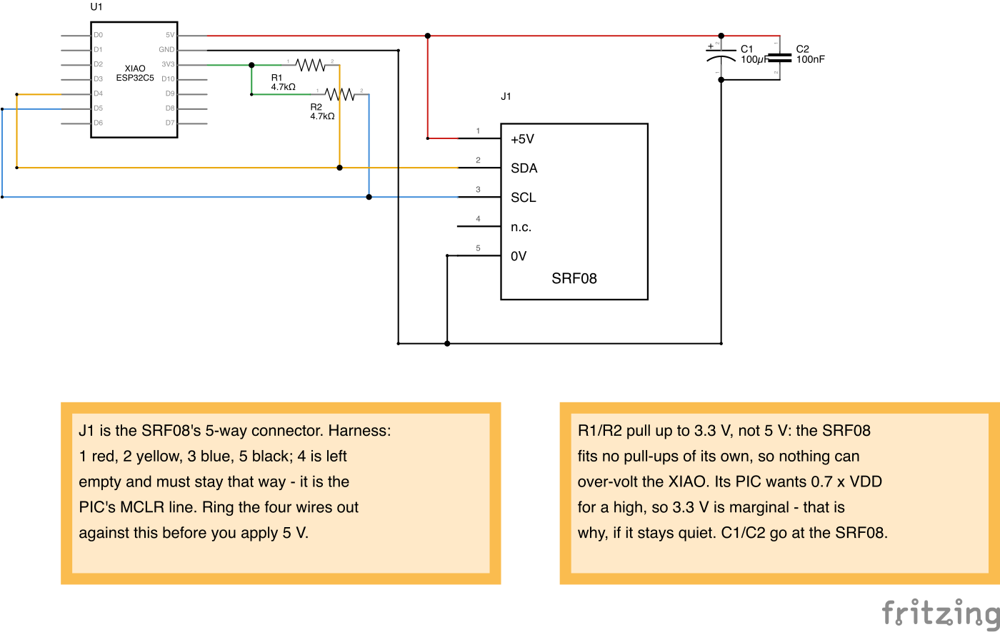

# srf08_range

Read the Devantech SRF08 ultrasonic rangefinder (parts library
[S1](../../parts/s1.html)) from the XIAO ESP32-C5 over I²C, and print every
echo plus the light level to the USB console.

> **Bench result, 2026-09-20: S1's ultrasonic ranging is dead** — the fault is in
> its receive amplifier chain, and the board is now
> [retired](../../parts/s1.html). The firmware below is not the problem: it finds
> the sensor at `0xE0`, reads revision 6, and the light sensor works. Every ping
> just reports `no echo`. Kept as a working I²C example and a bench target.

## Wiring



`srf08_range.fzz` is the source for that drawing; re-render it with
`Fritzing -svg <dir>` and commit the PNG beside it.

| XIAO pad | GPIO | SRF08 pin | Harness wire |
| --- | --- | --- | --- |
| `D4` | 23 | 2 `SDA` | yellow |
| `D5` | 24 | 3 `SCL` | blue |
| `5V` | — | 1 `+5V` | red |
| `GND` | — | 5 `0V` | black |

Plus the two pull-ups: 4.7 kΩ from SDA to `3V3`, and 4.7 kΩ from SCL to `3V3`.
They are not optional — nothing else on this bus pulls it high. The XIAO's
internal pull-ups don't count: at ~45 kΩ they are far too weak, and the
firmware disables them.

The harness is four hand-soldered wires into a 4-way DuPont housing, with the
`do not connect` position deliberately left empty. Ring it out against the
documented pinout before trusting the colours. SRF08 pin 4 is the PIC's `MCLR`
line — leave it unconnected, as the harness already does.

`D4`/`D5` are the board's labelled I²C pins; nothing else on the XIAO wants
them. The XIAO's `5V` pad is USB VBUS, so the SRF08 is only powered when the
board is on USB — fine for bench work, but the robot will need its own 5 V rail.

**Decoupling.** The SRF08 draws ~12 mA ranging and ~3 mA idle, but with ~275 mA
peaks a few microseconds long as it drives the transmitter. Put 100 µF
electrolytic plus 100 nF ceramic across +5 V and 0 V right at the module, and
keep the power wires short and fat. Skipping this shows up as a bus that locks
up on every ping, which looks like a software fault and isn't.

## Why 3.3 V pull-ups on a 5 V sensor

The SRF08 runs at 5 V and the XIAO's GPIOs are not 5 V tolerant, so the
direction of the pull-ups is the whole question. I²C is open-drain — nobody
drives the bus high, the pull-up resistors do — and **S1 has none of its own**
(measured 2026-09-20: +5 V to SDA ≈ 1.5–2 MΩ, +5 V to SCL ≈ 600 kΩ, both
leakage through the PIC rather than resistors; see its
[parts page](../../parts/s1.html)).

So pulling up to 3.3 V sets the whole bus to 3.3 V, and nothing can put 5 V on
GPIO23/24. Pulling up to 5 V instead would damage the XIAO — don't.

The cost of that choice is margin at the other end: the SRF08's PIC wants
`VIH ≥ 0.7 × VDD` for a logic high, so 3.3 V sits a little under a 5.0 V-rail
threshold. Note it tracks the sensor's own supply, so a rail sagging toward
4.6 V moves the threshold in your favour. If the sensor is intermittent rather
than silent, this is the first thing to suspect; a scan that finds nothing at
all points at the harness instead.

## Addressing

Devantech quote the SRF08's address as `0xE0`, an 8-bit address including the
read/write bit. ESP-IDF wants 7-bit, so `0xE0 >> 1 = 0x70`. The 16 possible
addresses `0xE0`–`0xFE` are `0x70`–`0x7F` in 7-bit terms, which runs into the
I²C reserved block at `0x78` — so the firmware scans `0x03`–`0x7F` rather than
the conventional `0x08`–`0x77`, or it could miss a readdressed module. S1 came
off an old robot, so it may well have been moved off `0xE0`.

## What the firmware does

1. Scans the bus and logs everything that answers, with both address forms.
2. Picks the first device in the SRF08 range and reads register 0 — the
   software revision, and the cheapest liveness check available.
3. Sets gain 31 and range 68, i.e. `(68 × 43 mm) + 43 mm ≈ 3 m` of listening
   window. Shorter window, fewer spurious far echoes, faster cycle.
4. Pings 4× a second, printing the light level and every echo the module
   heard — up to 17, nearest first. Seeing past a near obstacle is what this
   module has over an HC-SR04.

Expect the beam to be a ~55° cone, so aim it well above the floor or the floor
is what you'll range.

## Build and flash

```bash
source ~/.espressif/tools/activate_idf_v6.1.sh
idf.py build
idf.py -p /dev/cu.usbmodem* flash monitor
```
